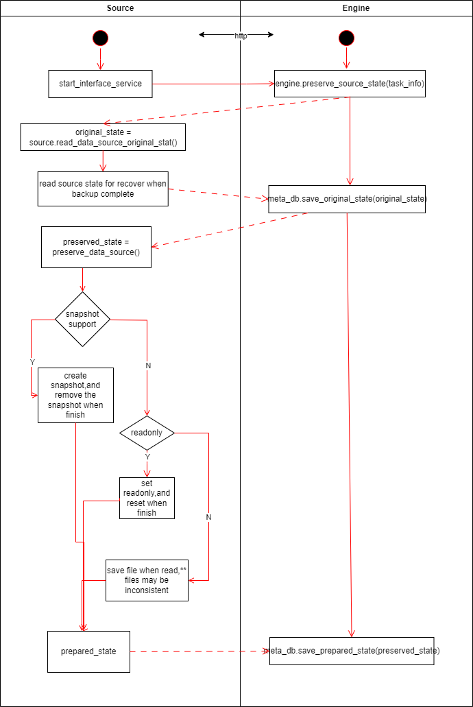
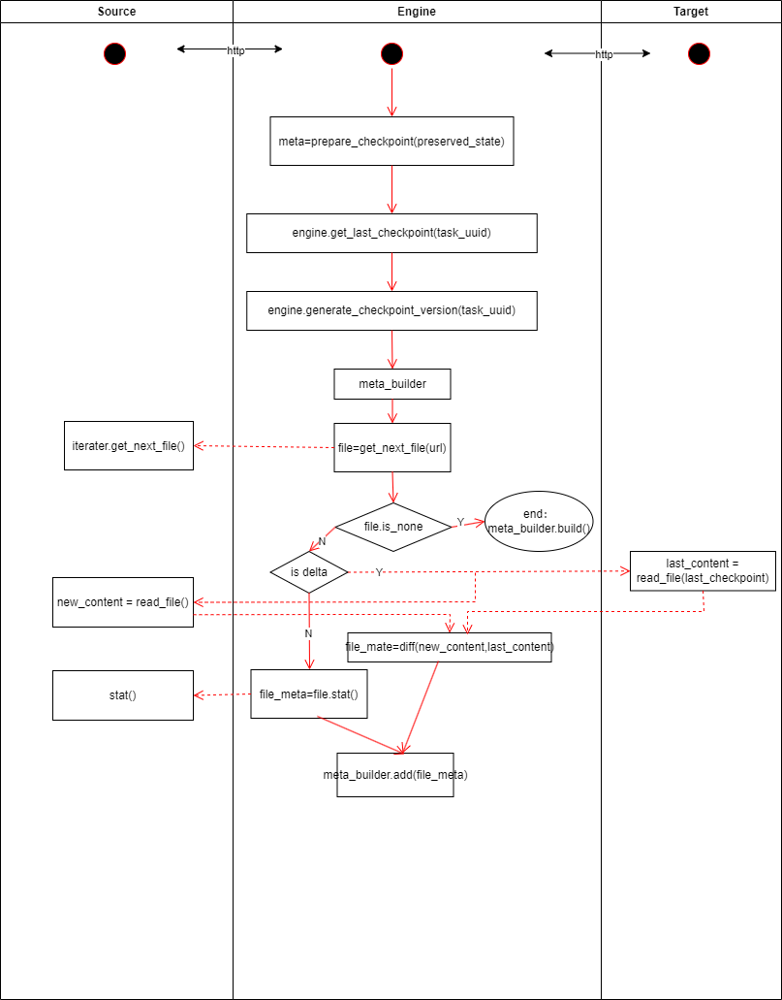
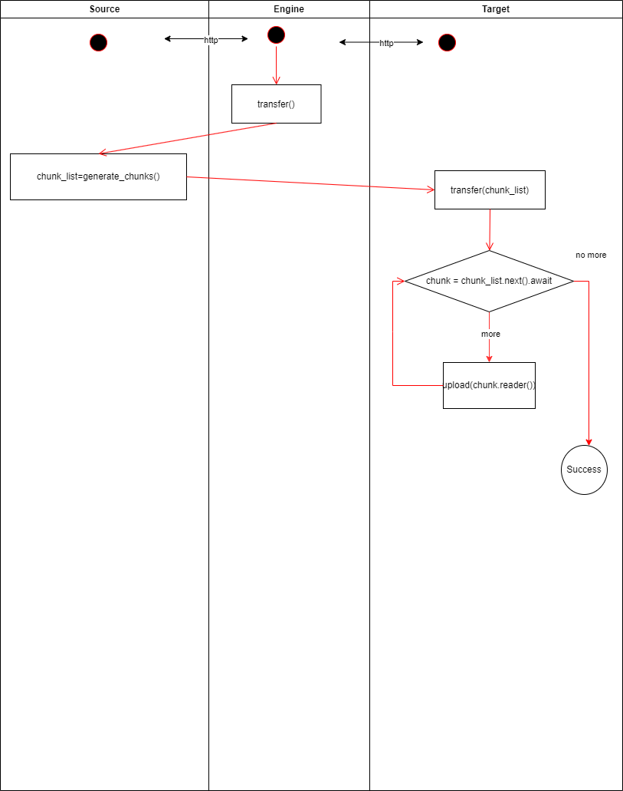

## Goal

1. Implement backup for binary files (directories).
2. Support various backup source data forms (local files, different cloud storage providers, DMC, etc.).
3. Support various backup storage media (local files/external hard drives, different cloud storage providers, DMC, etc.).
4. Be compatible with large storage systems for basic storage units (DMC).
    - Friendly support for packaging small files and splitting large files.
5. Ensure that each storage unit's data is complete; reading data from one unit should not depend on other storage units. Damage to one storage unit should not affect the others.
    - Each storage block should retain its internal data metadata.
6. The interface layer should be compatible with traditional file-based access methods.
7. Local storage of some metadata is allowed for acceleration, but in extreme cases, data should be fully recoverable using only account information without relying on local data.
8. Should be able to run independently on multiple platforms (NAS, PC, etc.).

## Basic Architecture

The entire process can be divided into 4 steps:

1. **Prepare Data Source**: Ensure that the data source is read-only during the backup process. If any write operations are performed during this period, the original state should be restored upon completion or abnormal termination of the backup. Some exceptions may not be automatically recoverable, so users should be provided with the ability to trigger a state recovery.

    

2. **Construct Metadata**: During this phase, construct all the metadata for the data to be backed up according to the user's requirements. The output structure at this stage should clearly inform the user of what information will be backed up and the approximate space required.

    

3. **Populate Metadata for Specific Backup `Target`**: Some `Targets` may need to record specific information in the metadata, such as the exact storage locations of files. This part of the metadata is parsed by the specific `Target`.

4. **Transfer**: Complete the data transfer based on the metadata constructed in the previous steps.

    

\*\* Modules communicate with each other using HTTP protocol calls to decouple dependencies between extension modules, thereby enhancing scalability and stability.
