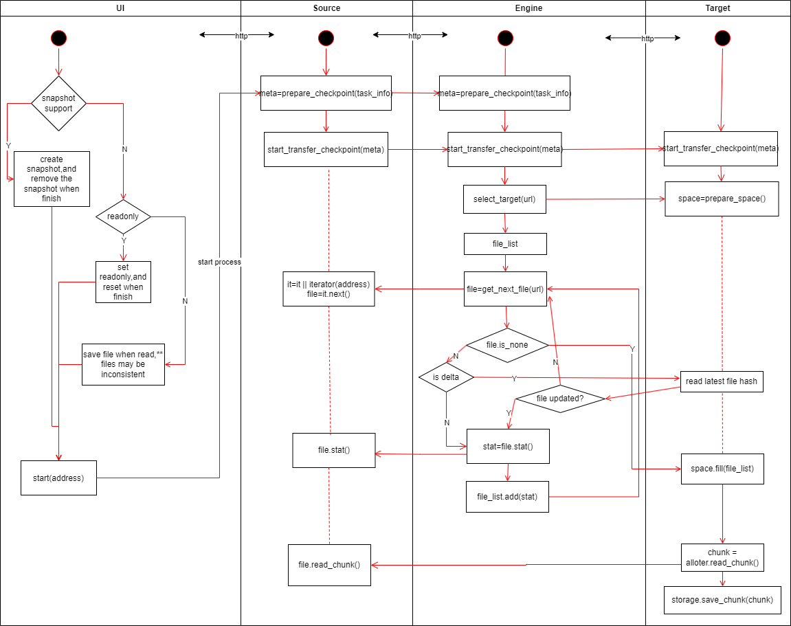

# 目标

1. 实现二进制文件（目录）的备份
2. 支持扩展多种备份源数据形式(本地文件，不同云存储厂商，DMC 等)
3. 支持扩展多种备份存储介质（本地文件/移动硬盘等，不同云存储厂商，DMC...）
4. 兼容基本存储单元超大的存储系统(DMC)
    - 友好支持打包小文件和分割大文件
5. 每个存储单元存储的数据应该是完备的，读取本单元数据不依赖其他存储单元，损坏一个存储单元数据不影响其他存储单元。
    - 各存储块自己保留内部数据的元信息
6. 接口层兼容传统以文件为单位的存取方式
7. 本地可存储部分元数据用于加速，但极端情况下可脱离本地数据仅通过账号信息完整地恢复数据。
8. 可独立运行于多个平台(NAS, PC 等)

# 基本架构



\*\* 各模块之间用 http 协议相互调用，以解除各扩展模块之间的依赖，提高扩展性和稳定性

# Engine

## Prepare

```rust
// Prepare the metadata before pushing the data to storage.
// metadata should contain:
// 1. data items should pushing up,
// 2. prev-checkpoint the new checkpoint depending on,
// 3. measure the space size, it should be larger the consume really.
engine.prepare_checkpoint(
    task_unique_name,
    (target_service_type, target_service_name),
    (source_type, source_interface_url, source_session_id),
    is_delta,
    ) -> CheckPointMeta {

        let source_reader = make_source_reader(source_interface_url, task_unique_name, source_session_id);
        let target = select_target(target_service_type, target_service);
        let (last_complete_checkpoint, last_checkpoint, pushing_checkpoints) = target.get_last_checkpoint(task_unique_name);
        let checkpoint_version = target.generate_checkpoint_version(task_unique_name);
        let mut meta_builder = MetaBuilder::new()
            .task_unique_name(task_unique_name)
            .target_service(target_service_type, target_service_name)
            .checkpoint(checkpoint_version)
            .source(source_type, souce_interface_url, source_session_id);

        let prev_checkpoints = if is_delta {
            meta_builder.prev_checkpoint(last_complete_checkpoint.version);

            let mut prev_checkpoints = vec![last_complete_checkpoint];
            let mut cur_checkpoints = &last_complete_checkpoint;
            while let Some(prev_checkpoint_version) = cur_checkpoints.prev_checkpoint() {
                let prev_checkpoint = target.get_checkpoint_by_version(prev_checkpoint_version);
                prev_checkpoints.push(prev_checkpoint);
            }
        } else {
            vec![]
        };

        while let Some(item) = source_reader.get_next_item() {
            // * item may be a file/directory/link, we should process it separately.
            if is_delta {
                let last_stat = prev_checkpoints.get_stat(item.path);
                if !last_stat.is_same_as(item.stat) {
                    meta_builder.add_item(item);
                }
            } else {
                meta_builder.add_item(item);
            }
        }

        if is_delta {
            while let Some(item) = prev_checkpoints.get_next_item() {
                if !source_reader.is_exists(item.path) {
                    meta_builder.add_log(Log::Remove(item.path));
                }
            }
        }

        meta_builder.build()
}
```

```rust
engine.on_push_new_checkpoint(
    meta: CheckPointMeta,
    uncomplete_strategy
    ) {

        let source_reader = make_source_reader(meta.source_interface_url, meta.task_unique_name, meta.source_session_id);
        let target = select_target(meta.target_service_type, meta.target_service);
        let (last_complete_checkpoint, last_checkpoint, pushing_checkpoints) = target.get_last_checkpoint(meta.task_unique_name);
        let mut abort_checkpoints = vec![];

        for pushing_checkpoint in push_checkpoints {
            if uncomplete_strategy.check_abort(pushing_checkpoint, last_complete_checkpoint, REASON_PUSH_NEW_CHECKPOINT) {
                // abort it when new checkpoint prepared.
                abort_checkpoints.push(pushing_checkpoint);
            }
        }

        local_meta_storage.begin_checkpoint(meta, abort_checkpoints);

        target.push_checkpoint(meta);

        for abort_checkpoint in abort_checkpoints {
            abort_checkpoint.abort();
            // remove when it's aborted by target
            local_meta_storage.abort(abort_checkpoint);
            target.abort(abort_checkpoint);
        }
}
```

```rust
target.on_push_checkpoint(meta) {
    // ** attention: reentry
    let mut spaces = vec![];
    for item in meta.items() {
        let space = alloc_space(item);
        spaces.push(space);
    }

    local_storage.prepare_space(spaces);

    for space in spaces {
        space.write_header(make_header(space));
        for item in space.items() {
            let source_reader = make_source_reader(meta, meta.get_item(item));
            let chunk = source_reader.read_chunk(item.path, item.offset, item.length);
            let chunk = crypto(chunk);
            space.write_chunk(chunk);
        }
        space.write_meta(crypto(space.meta));

        local_storage.pre_push(space);

        space.push();

        local_storage.push_complete(space);
    }

    engine.check_point_complete(meta);
}
```

```rust
source.start_push_checkpoint() {
    // TODO:
}
```

```rust
target.on_abort(checkpoint) {
    let spaces = find_spaces(checkpoint);

    for space in spaces {
        local_storage.pre_free_space(space);
        space.free();
        local_storage.free_space(space);
    }

    // remove the checkpoint
    engine.check_point_space_free(checkpoint);
}
```

```rust
engine.export() {
    let tasks = local_meta_storage.export();

    let mut toml = Toml.create();

    for t in tasks {
        toml.write_section(t.unique_task_name);
        for checkpoint in t. checkpoints {
            toml.write_section(checkpoint.version);
            toml.write_attribute(checkpoint);
            let target = select_target(checkpoint.target_service);
            let content = target.export(); // export valid attributes only
            toml.write_target_attributes(content);
        }
    }
}
```
