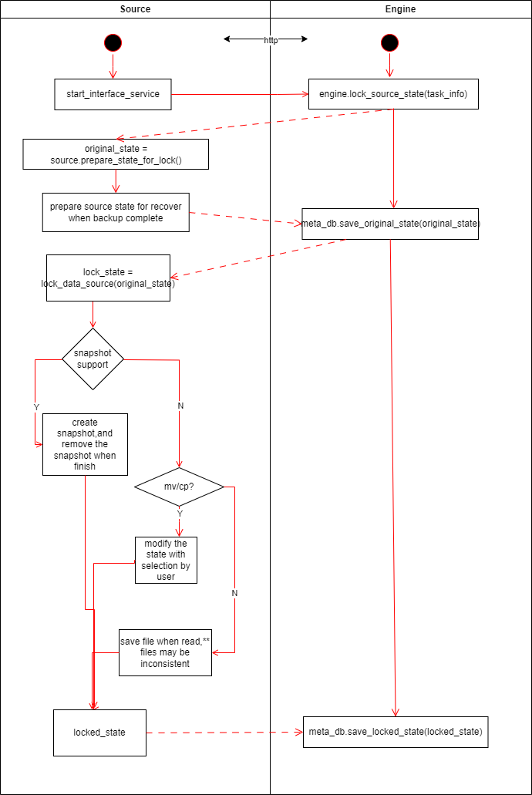
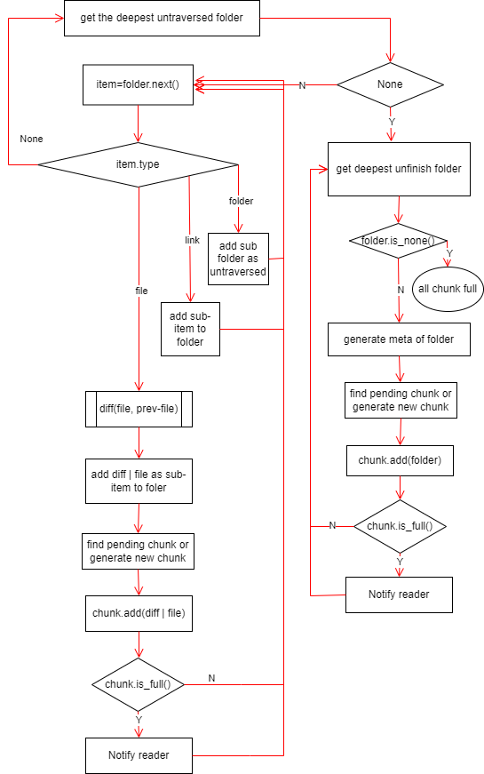

# 目标

1. 实现二进制文件（目录）的备份
2. 支持扩展多种备份源数据形式(本地文件，不同云存储厂商，DMC 等)
3. 支持扩展多种备份存储介质（本地文件/移动硬盘等，不同云存储厂商，DMC...）
4. 兼容基本存储单元超大的存储系统(DMC)
    - 友好支持打包小文件和分割大文件
5. 每个存储单元存储的数据应该是完备的，读取本单元数据不依赖其他存储单元，损坏一个存储单元数据不影响其他存储单元。
    - 各存储块自己保留内部数据的元信息
6. 接口层兼容传统以文件为单位的存取方式
7. 本地可存储部分元数据用于加速，但极端情况下可脱离本地数据仅通过账号信息完整地恢复数据。
8. 可独立运行于多个平台(NAS, PC 等)

# 基本架构

整个过程大概分为 3 个步骤：

1. 锁定数据源：尽可能保证备份期间数据源是确定的，这期间如果执行了任意写操作，要在备份完成或者异常中止时恢复原始状态，某些异常可能无法自动恢复状态，应该给用户触发恢复状态的可能性。

2. 打包数据源：这期间按照用户的要求把数据源打包成目标格式（切割/打包成数据块，或者把数据块还原成目录），这个阶段的输出结构能够让用户明确知道将会备份哪些信息，大致占用空间大小。

3. 传输：基于前述步骤构造的元数据完成数据的传输，这个步骤可以和第 2 步并行执行，也可以串行执行。

\*\* 各模块之间用 http 协议相互调用，以解除各扩展模块之间的依赖，提高扩展性和稳定性
